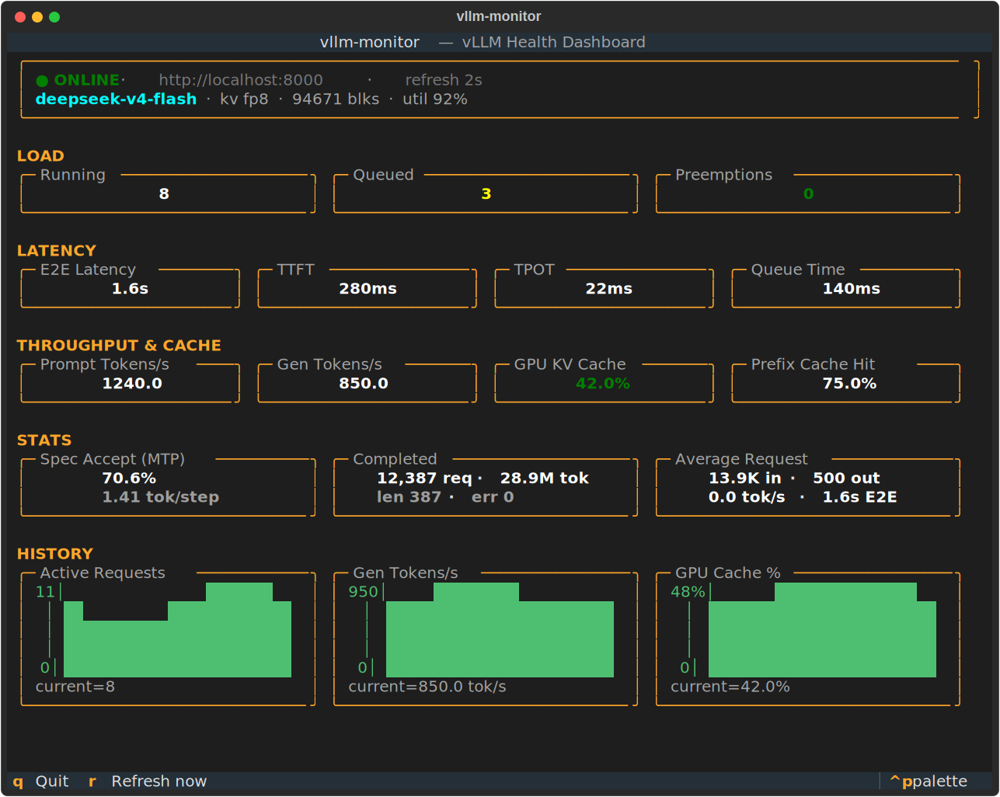

# vllm-monitor

Real-time terminal UI dashboard for monitoring [vLLM](https://github.com/vllm-project/vllm) server metrics. No Grafana required.



## Features

- **Request load**: running, queued, and preemption counts (preemptions flag KV-cache pressure)
- **Latency**: end-to-end, time-to-first-token (TTFT), time-per-output-token (TPOT), and queue time — recent means with units auto-scaled to magnitude (ms / s / m / h)
- **Throughput**: prompt and generation tokens/sec
- **Cache**: GPU KV-cache utilization and prefix cache hit rate, with alert colors (yellow ≥ 80%, red ≥ 95% on KV cache)
- **Speculative decoding (MTP)**: acceptance rate and accept length (accepted tokens per draft step); shows `—` when spec decode is off
- **Completed requests**: totals (requests + tokens) with a finish-reason breakdown (truncated-by-length, errors)
- **Average request shape**: mean prompt (input) vs generation (output) tokens per request
- **History charts**: rolling 60-sample multi-row bar charts with a y-axis scale for active requests, generation throughput, and KV-cache usage
- **Model panel**: model name (read from the `model_name` metric label every poll, so it follows model changes after a restart) plus cache config — KV dtype, GPU blocks, memory-utilization target
- **Clean TUI**: tiles grouped into labeled sections, framed header, a centered/outlined command palette (`Ctrl+P`), and the `ansi-dark` theme by default
- **Graceful degradation**: any metric the server doesn't expose simply shows `—`
- **Configurable poll interval** (default 2s)

## Installation

Install from source, or use the [Docker image](#docker).

```bash
# Recommended: isolated install with pipx
pipx install git+https://github.com/tomaskir/vllm-monitor

# or with pip
pip install git+https://github.com/tomaskir/vllm-monitor
```

## Docker

A prebuilt image is published to GitHub Container Registry on every release
(tags: `latest`, `X.Y.Z`, `X.Y`). vllm-monitor is a **client** — it connects
out to a vLLM server and renders a terminal UI, so run it with `-it` (a TTY)
and `--log-driver none` (see [Why disable container logging](#why-disable-container-logging)).
It serves no ports.

```bash
# Pull the latest release
docker pull ghcr.io/tomaskir/vllm-monitor:latest

# Monitor a remote vLLM server
docker run --rm -it --log-driver none ghcr.io/tomaskir/vllm-monitor --url http://10.0.0.5:8000

# Monitor vLLM on the same host (Linux): share the host network
docker run --rm -it --log-driver none --network host ghcr.io/tomaskir/vllm-monitor --url http://localhost:8000

# Configure entirely via environment variables
docker run --rm -it --log-driver none \
  -e VLLM_URL=http://10.0.0.5:8000 \
  -e VLLM_API_KEY=mytoken \
  -e VLLM_MONITOR_INTERVAL=1 \
  ghcr.io/tomaskir/vllm-monitor
```

| Env var | Equivalent flag | Default |
|---------|-----------------|---------|
| `VLLM_URL` | `--url` | `http://localhost:8000` |
| `VLLM_API_KEY` | `--api-key` | _(none)_ |
| `VLLM_MONITOR_INTERVAL` | `--interval` | `2` |

Build it yourself:

```bash
docker build -t vllm-monitor .
docker run --rm -it --log-driver none vllm-monitor --url http://10.0.0.5:8000
```

> `-it` is required — without a TTY the TUI cannot render. `--rm` removes the container on exit.

### Why disable container logging?

`--log-driver none` is on every command above for a reason — and it's not
something the app can fix. `-it` allocates a TTY but does **not** stop Docker
from logging: the default `json-file` driver records everything the container's
main process writes to `…-json.log`, and with a TTY attached that stream *is*
the TUI's raw output — a non-stop flood of screen-repaint escape sequences
(~1 GB/day). `--rm` only reclaims the file when the container *exits*, so a
dashboard left running for weeks can quietly grow a multi-gigabyte log.

A terminal UI has no choice but to emit those sequences to draw itself, and the
stream you watch and the stream Docker records are the same pty — so there is no
application-side fix. Since you read this dashboard live and never need its
output persisted, the honest answer is to tell Docker to drop it with
`--log-driver none`.

If you do want to keep logs, cap them with rotation instead —
`--log-opt max-size=10m --log-opt max-file=3` — or set the same `log-opts`
under `log-driver: json-file` in `/etc/docker/daemon.json` (then restart the
daemon) to protect every container on the host.

## Usage

```bash
# Monitor local vLLM server (default: http://localhost:8000, 2s interval)
vllm-monitor

# Custom server URL
vllm-monitor --url http://my-vllm-server:8000

# Faster refresh
vllm-monitor --interval 1

# With API key
vllm-monitor --url http://my-server:8000 --api-key mytoken
```

Every option can also be set via environment variable: `VLLM_URL`, `VLLM_API_KEY`, `VLLM_MONITOR_INTERVAL`.

### Key Bindings

| Key | Action |
|-----|--------|
| `q` | Quit |
| `r` | Refresh immediately |
| `Ctrl+P` | Command palette |

## Metrics Displayed

| Metric | Source | Description |
|--------|--------|-------------|
| Running | `vllm:num_requests_running` | Requests actively being processed |
| Queued | `vllm:num_requests_waiting` | Requests waiting for GPU capacity |
| Preemptions | `vllm:num_preemptions_total` | Requests evicted under KV-cache pressure (green at 0) |
| E2E Latency | `vllm:e2e_request_latency_seconds` | Mean end-to-end request latency |
| TTFT | `vllm:time_to_first_token_seconds` | Mean time to first token |
| TPOT | `vllm:request_time_per_output_token_seconds` | Mean time per output token |
| Queue Time | `vllm:request_queue_time_seconds` | Mean time a request waits before scheduling |
| Prompt Tokens/s | `vllm:prompt_tokens_total` (rate) | Prompt token processing throughput |
| Gen Tokens/s | `vllm:generation_tokens_total` (rate) | Token generation throughput |
| GPU KV Cache | `vllm:kv_cache_usage_perc` (falls back to `vllm:gpu_cache_usage_perc`) | KV cache block utilization |
| Prefix Cache Hit | `vllm:prefix_cache_hits_total` / `vllm:prefix_cache_queries_total` | Prefix cache hit rate |
| Spec Accept (MTP) | `vllm:spec_decode_num_{accepted_tokens,draft_tokens,drafts}_total` | Acceptance rate and accepted tokens per draft step |
| Completed | `vllm:request_success_total` (by `finished_reason`) | Completed requests + tokens, with truncated/errored split |
| Avg Req Tokens | `vllm:request_prompt_tokens` / `vllm:request_generation_tokens` | Mean prompt / generation tokens per request |
| Model / config | `model_name` label, `vllm:cache_config_info` | Model name, KV dtype, GPU blocks, mem-util target |

Latency values are *recent* means (the change in the histogram's sum/count between polls), falling back to the cumulative mean. Any metric the server doesn't expose is shown as `—`.

## Requirements

- Python 3.10+
- A vLLM server exposing `/metrics` (Prometheus — enabled by default). Works with the vLLM **v1** engine metric names. Everything (including the model name, via the `model_name` label) comes from `/metrics` — no `/v1/models` request is made.

## Development

```bash
pip install -e ".[dev]"
pytest
```

Regenerate the README screenshot with `python scripts/screenshot.py`.

## Acknowledgments

Originally created by [Dennis Reichenberg](https://github.com/dennisreichenberg) and now maintained by [Tomas Kirnak](https://github.com/tomaskir).

## License

MIT — see [LICENSE](LICENSE).
